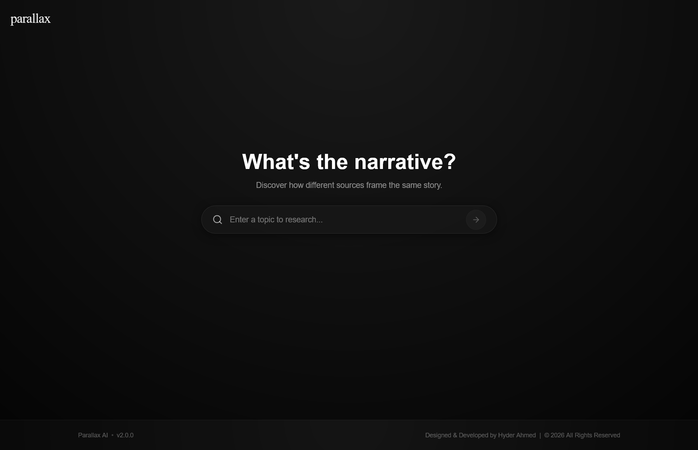
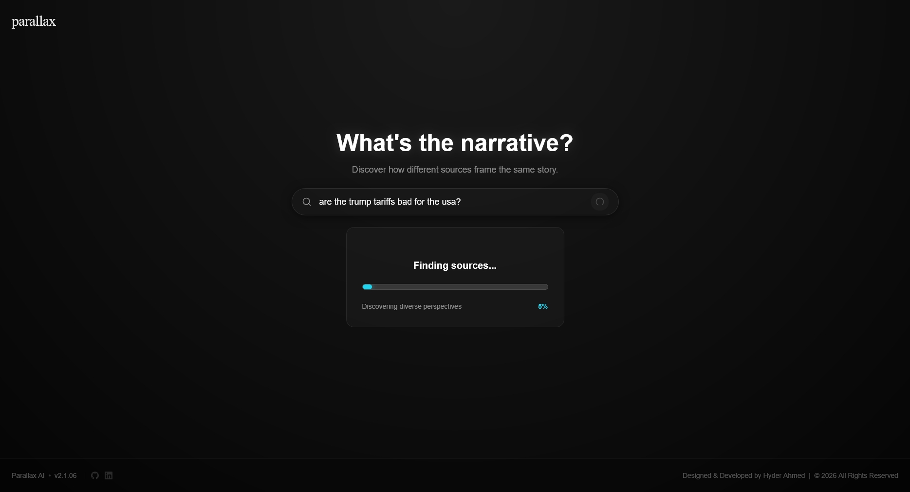
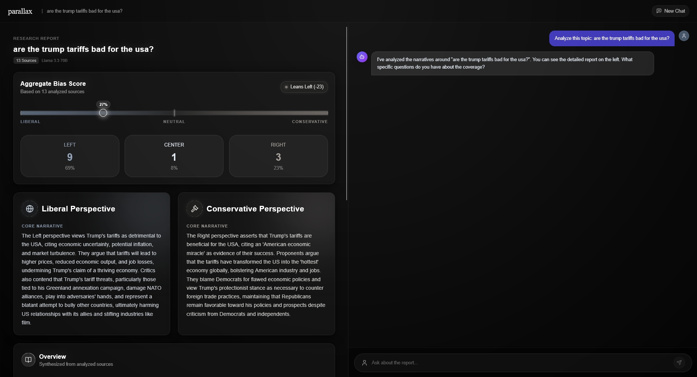
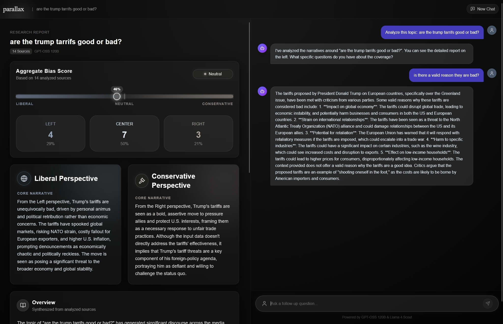
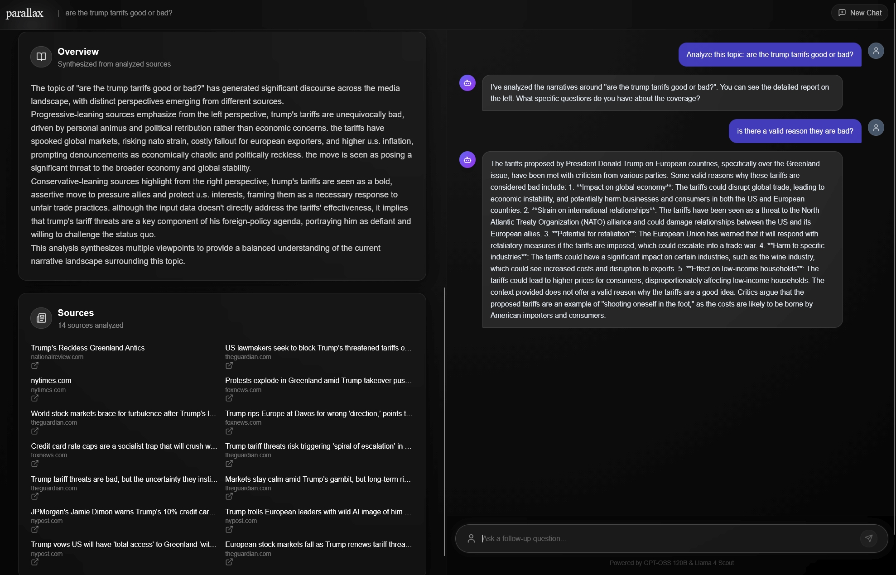

# Parallax AI


**Autonomous Narrative Intelligence & Media Bias Analysis Platform**

## Executive Summary

Parallax AI is a distributed research system designed to quantify and visualize media bias in real-time. In the current information landscape, news outlets often present conflicting realities of the same event, a phenomenon I call the "Parallax Gap." This project closes that gap by deploying an autonomous AI agent to read, parse, and cross-reference reporting from the Left, Center, and Right.

Unlike simple summarization tools, Parallax AI performs **comparative narrative analysis**. It doesn't just tell you what happened; it tells you what each side is *ignoring*, effectively automating the workload of a media analyst. By analyzing omissions and framing differences, it provides a comprehensive, synthesized view of the truth that no single source offers.

The system is built on a production-grade microservices architecture, utilizing **Go** for high-throughput data ingestion and **Python** for complex cognitive processing, all streamed to a **Next.js** client via Server-Sent Events (SSE).

## Technical Architecture & Engineering Decisions

I architected the system to balance two competing needs: the raw I/O speed required to scrape dozens of sites simultaneously, and the heavy computational logic required for LLM-based reasoning.

### 1. Hybrid Microservices Strategy
Instead of a monolithic application, I decoupled the scraping logic from the analysis logic.
*   **The Ingestion Engine (Go/Gin)**: Web scraping is an I/O-bound task that benefits heavily from concurrency. I built the scraper in Go to leverage **Goroutines**, allowing the system to fetch, clean, and normalize HTML from 15+ sources in parallel with near-zero overhead. A Python equivalent would have struggled with the Global Interpreter Lock (GIL) under this specific load.
*   **The Cognitive Core (Python/FastAPI)**: complex text processing and LLM orchestration are best handled in Python. This service acts as the controller, managing the Retrieval Augmented Generation (RAG) pipeline, prompt engineering, and context window management for the Llama 3 model.

### 2. Retrieval & Synthesis Pipeline (RAG)
The "Initiate Research" action triggers a multi-step autonomous workflow:
1.  **Semantic Discovery**: The agent queries the Google News API (via SerpAPI) to identify high-authority sources across the political spectrum.
2.  **Content Extraction**: The Go service strips boilerplate (ads, navbars) using custom heuristics to maximize the "signal-to-noise" ratio for the LLM's context window.
3.  **Bias Classification**: Before analysis, the system classifies the political lean of each source using a zero-shot classification step, ensuring the final report is balanced.
4.  **Narrative Synthesis**: The core innovation. The model is prompted to perform "Narrative Extraction", identifying the coherent story being told by a cluster of articles, rather than simple summarization.

### 3. Real-Time Event Streaming (SSE)
To prevent the "black box" delay common in AI apps, I implemented **Server-Sent Events (SSE)**. The backend pushes granular status updates ("Scraping CNN...", "Synthesizing Left Narrative...") to the frontend. This keeps the user engaged during the 15-30 second analysis window and provides immediate feedback on the agent's "thought process."

### 4. Semantic Caching & Persistence
The system uses **PostgreSQL** not just for logging, but as a semantic cache. Analysis results are stored with their source metadata. When a user asks a follow-up question in the chat, the agent retrieves this specific historical context from the database, allowing it to cite specific articles and quotes even tens of turns into a conversation.

## System Workflow & Demo

### 1. Initiate Research
The user inputs a topic. The system immediately fans out to discover diverse sources.



### 2. Autonomous Synthesis
The agent visualizes its progress as it reads and synthesizes disjointed narratives into a coherent whole.



### 3. Deep Analysis Report
The final output includes a calculated **Bias Score** and a dual-pane **Narrative Comparison**. This allows users to read the "Left Perspective" and "Right Perspective" side-by-side to instantly spot framing differences.





### 4. Context-Aware Chat
The proprietary "Deep Dive" chat allows users to interrogate the data. Because the agent has "read" the source text, it can answer specific questions about omissions (e.g., "Did the conservative sources mention the inflation report?").



## Installation & Deployment

**Prerequisites**: [Docker Desktop](https://www.docker.com/products/docker-desktop/), [Groq API Key](https://console.groq.com/), [SerpAPI Key](https://serpapi.com/).

### Local Setup

1.  **Clone the repository**
    ```bash
    git clone https://github.com/yourusername/parallax-ai.git
    cd parallax-ai
    ```

2.  **Configure Environment**
    Create a `.env` file in the root directory:
    ```ini
    GROQ_API_KEY=your_groq_key
    SERP_API_KEY=your_serp_key
    ```

3.  **Start the Cluster**
    ```bash
    docker-compose up --build
    ```
    Access the frontend at [http://localhost:3000](http://localhost:3000).

### Cloud Deployment (Render)

The project includes a `render.yaml` blueprint for Infrastructure-as-Code deployment.
*   **Auto-Deploy**: Pushing to `main` triggers a build pipeline.
*   **Service Discovery**: The `render.yaml` configures internal networking so the Python Agent can securely talk to the Go Scraper without exposing endpoints to the public internet.

---
*Designed & Developed by Hyder Ahmed | © 2026 All Rights Reserved*
